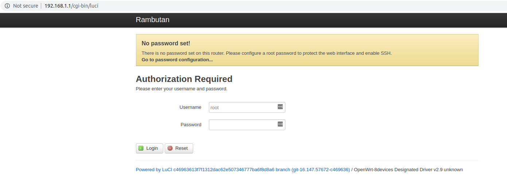
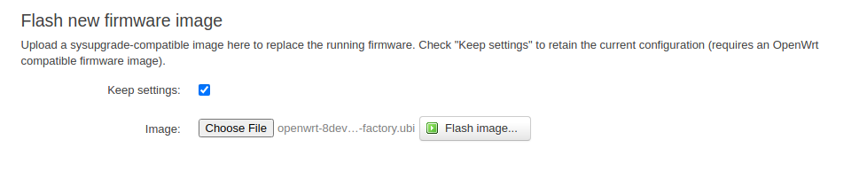
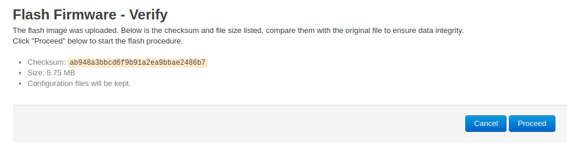
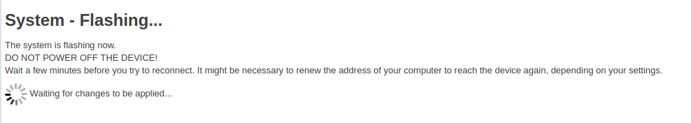
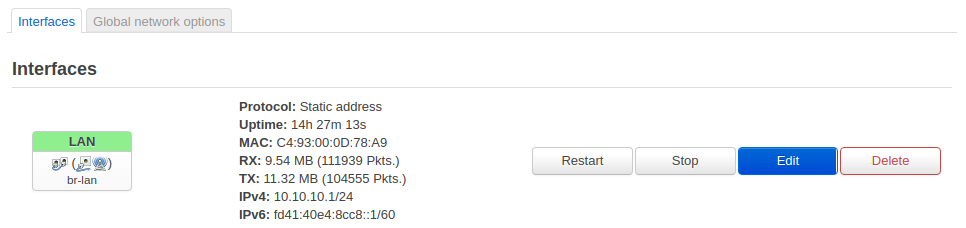
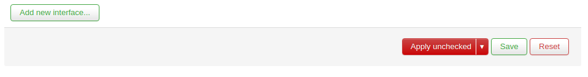
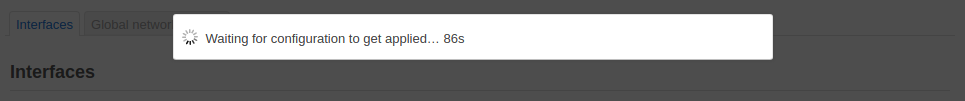
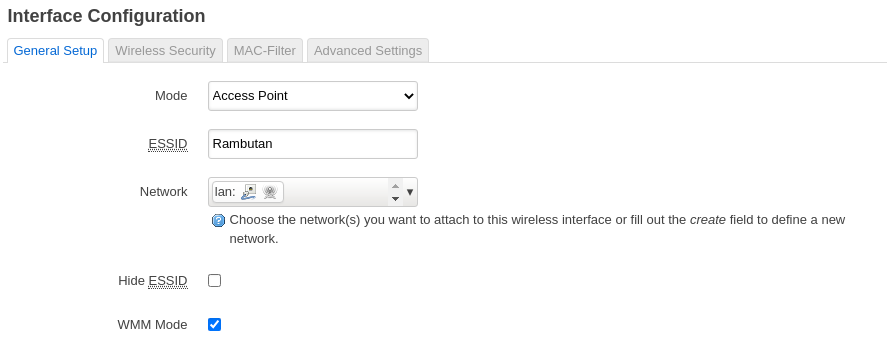

# Router Setup
In our vehicle design, we have chosen to use a separate single-board computer to act as an independent WiFi router through which all LAN communication will occur. While it is possible to plug a USB WiFi adapter into the Jetson Nano and have the Nano act as an Access Point, there are some potential downsides. As a rationale for using the Rambutan:

  - USB WiFi dongle solutions vary greatly in driver quality, stability, and performance. The Rambutan is a solid, reliable solution that has been used in commercial products.
  - By having an independent router handle WiFi connectivity, you can reduce the amount of configuration changes and customizations needed on the Nano, also avoiding the chance of unintentionally misconfiguring the network in the future.
  - The Rambutan features decent transmit power, support for MIMO, and support for 5GHz, aiding in improved performance and flexibility when operating in crowded 2.4GHz airspace.
  - It also has excellent WiFi drivers, coming from the OpenWRT dev efforts (the OS that the Rambutan runs).
  - More advanced network topologies can benefit from the additional flexibility and capabilities provided by having an internal router.
  - It is easy to provide your vehicle with an internet connection while simultaneously having full LAN connectivity by using the Rambutan's ETH0 port which is configured as a gateway. 

# Pre-reqs
First, download the latest OpenWRT image from 8device's Github releases (v2.11 as of the writing of this guide). We will be using this to perform an upgrade of the Rambutan's firmware before beginning configuration:
  - https://github.com/8devices/openwrt-8devices/releases/tag/v2.11-ath71xx
  - You will want the following file:
    - openwrt-8devices-v2.11-ar71xx-nand-rambutan-squashfs-factory.ubi

  


# Connecting to the Rambutan
Connect your computer/laptop via ethernet to the ETH1 port on the Rambutan (this is the center ethernet port with the smaller black chip beside it).
```
NOTE: You may need to disconnect from your home WiFi router if it uses the same 192.168.1.0/24 subnet, as it will conflict with the Rambutan, which also defaults to assigning IP addresses on this subnet.
```
  - Navigate in your browser to 192.168.1.1
  - You will be brought to a login page with a banner indicating that no password has been set yet.
  - Click `"Login"`

  

# Setting a Password
When you connect to the Rambutan for the first time, it will not have a password set for the root user. For security reasons, it is a good idea to set one immediately.
  - From the topbar, go to `"System->Administration"`
  - Enter your desired password, click `"Save/Apply"`, and wait for the new settings to be applied.

  


# Firmware Upgrade
Before proceeding, we will upgrade the firmware for the Rambutan to v2.11, as mentioned earlier.

  - From the topbar, go to `"System->Backup/Flash Firmware"`
  - Under `"Flash new firmware image"`, click `"Choose File"` and select the .ubi file downloaded earlier.
  - Click `"Flash Image"`



  - You will be taken to a new page to verify the operation to flash the firmware.
  - Click `"Proceed"`

  

  - You will be taken to a page that indicates that the flash is in progress.

  

  
  - Once it finishes, the page should automatically reload and bring you back to the login screen.
  - Log in once more.

# Changing the LAN Subnet
As mentioned earlier, the default address for the Rambutan is 192.168.1.1 and it assigns IP addresses on the 192.168.1.0/24 subnet. This has a very high likelihood of causing IP address conflicts on your computer when connected to both the Rambutan and your home/office WiFi router simultaneously, as many commodity routers default to using the same subnet. To prevent this, we recommend changing the address and subnet of the Rambutan now.

  - From the topbar, go to `"Network->Interfaces"`
  - Click on `"Edit"` for the LAN Network.

  

  - Change the value in the IPv4 Address box to 10.10.10.1 (or any LAN address that you are reasonably certain won't conflict with commodity WiFi systems)
  - Click "Save"

  

  - Click the drop down arrow to the right of "Save and Apply" and click "Apply Unchecked"

  

  - It will apply the settings and try to reconnect, but since the IP is changed, it will not be able to reach the page address.

  

 - Navigate now to 10.10.10.1 (or whichever IP you specified).
 - It will take some time for the router to finish applying the settings and assign you a new IP address.
   - You may need to unplug and replug the ethernet connector to either your computer or the Rambutan to get a new IP Address, or otherwise use the appropriate method within your OS to achieve the same effect.

Now you can reconnect to your personal WiFi/home network while simultaneously staying connected to the Rambutan's local network (effectively, your vehicle's private network).

# Configuring and Enabling WiFi
The last steps are to configure and enable the WiFi access point on the Rambutan, which is disabled by default for security reasons.

  - From the topbar, go to `"Network->Wireless"`

  

  - Click `"Edit"` on the "SSID: Rambutan" interface
  - Under the `"Device Configuration->General Setup"` tab:
    - Set transmit power to 21dBm (or the max allowed by your country's regulations). 
      - You can choose your country on the `"Device Configuration->Advanced Settings"` tab.
    - (Optional) Set the desired operating frequency mode, band, channel, and bandwidth, if desired. We recommend:
      - Mode: N
      - Band 2.4GHz
      - Channel: auto
      - Width: 20MHz

```
NOTE: If you are operating in a dense urban area or generally crowded 2.4GHz airspace, you may want to try using the 5GHz band.
```

  

  - Under the `"Interface Configuration->General Setup"` tab:
    - (Optional) If desired, you can change the ESSID from Rambutan to anything you desire (your vehicle's name is often a good choice).

  

  - (Recommended) Under the `"Interface Configuration->Wireless Security"` tab
    - Set the desired encryption type (such as WPA2-PSK) and key.

  

  - Click `"Save"`
  - Click `"Save & Apply"`.
  - The last step is to enable the WiFi interface we just configured. Click `"Enable"` (next to `"Edit"`).
  
Wait for the Access Point to come up. Once ready, you should now be able to connect your laptop and other devices to the Rambutan over WiFi. You can now disconnect the ethernet between your computer and the Rambutan. Any further modifications of settings can be done via WiFi.

# Other Notes
You can find the user guide from the manufacturer here:
  - https://www.8devices.com/wiki/rambutan:userguide