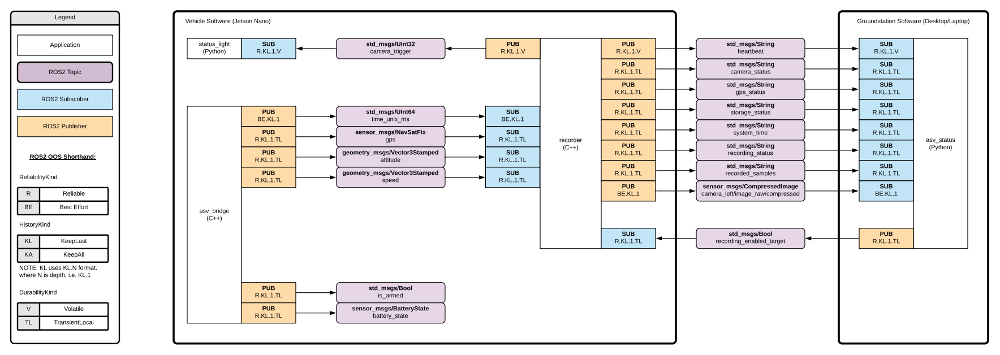
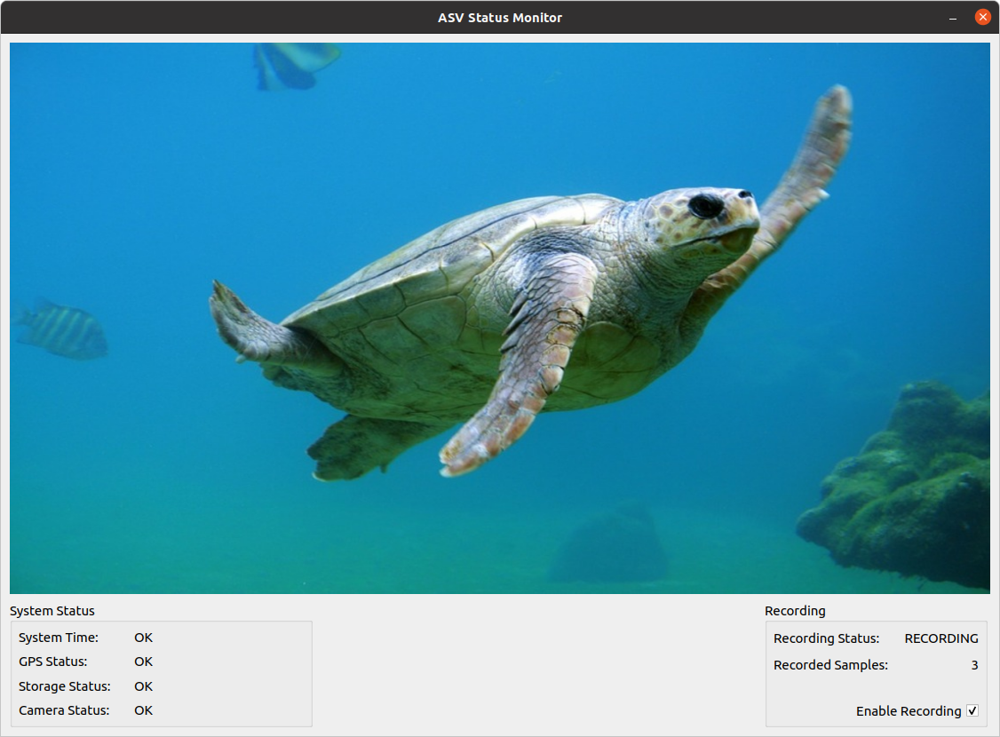

# Software Overview

Here is an image that shows the way all of the nodes connect together via ROS2 topics:

  

---

## Vehicle (Nano) Software

### Conan library packages

In: `/opt/openasv/vehicle/conan-packages`:

- `concurrentqueue`: threadsafe lockfree queue used by mavchannel
- `readerwriterqueue`: threadsafe lockfree queue used by mavchannel
- `serial`: serial port library used by mavchannel
- `mavchannel`: small library that combines serial, mavlink, and the threadsafe queues to provide a serial interface for devices that speak mavlink
- `mavlink2`: packaged version of the official mavlink repository. Mavlink is a communication protocol traditionally used within the Ardupilot/Ardusub space.

### ROS2 Nodes

There are three ROS2 nodes in the software package. Here is a short description of their functions:

- `asv_bridge`: This node bridges incoming Mavlink serial data from the Pixhawk to the ROS2 bus and vice-versa
- `recorder`: This node subscribes to telemetry data from the asv_bridge and captures frames from the ZED2 camera. When recording is enabled, it saves this data to disk.
  - This node also sends status info to the groundstation's `asv_status` node. The `asv_status` node lets you enable/disable recording.
- `status_light`: This node briefly flashes a status LED on the electronics enclosure each time a data sample is recorded by `recorder`.

### Mavproxy

There is one additional process that runs at startup along with the ROS2 nodes, which is called `mavproxy`. `mavproxy` bridges the incoming mavlink serial communication coming from the Pixhawk to a UDP interface being used to communicate with QGroundControl on the groundstation computer. This allows QGroundControl to establish a telemetry and control link with the Pixhawk when the groundstation is connected to the vehicle's WiFi access point.

## Using ROS2 tools

You can use the ROS2 command line utilities to interact with the applications in this project:

```bash
# Source the ROS2 Underlay
source /opt/ros/eloquent/setup.bash

# Some commands
ros2 topic list
ros2 topic echo "gps"
```

See the official ROS2 docs for more info about what tools are available and how to use them.

--- 

## Groundstation Software

### ROS2 Nodes
There are two ROS2 nodes included in the groundstation software:

`asv_status`: A GUI application that allows you to monitor the vehicle, enable/disable recording of ZED2 and telemetry data on the vehicle, and see the camera stream. Below is a screenshot of asv_status in action:



The items under System Status indicate the state of requirements necessary to enable recording of data. The system must sucessfully:

1. Receive a GPS time source
2. Attain a GPS fix
3. Find a valid location to store data in (as configured in recorder.yaml)
4. Successfully initialize the camera

Once all status elements read "OK" and the `Recording Status` on the right says "READY", you will be able to enable/disable recording by clicking the `Enable Recording` checkbox.

`mockbot`: An application that mimics the software running on the vehicle that can be used with `asv_status` to see how it works. Run this alongside `asv_status` on your desktop to get a preview of what will happen when the vehicle software is running.

### Ground Control Station

Additionally, the user is expected to use `QGroundControl`, a Qt-based Drone ground control station application, to configure and plan missions for the vehicle. For more information visit:

<http://qgroundcontrol.com/>

### Using ROS2 tools

Similarly to on the vehicle, you can use the ROS2 command line utilities to interact with any of the ROS2 nodes:

```bash
# Source the ROS2 Underlay
source /opt/ros/foxy/setup.bash

# Some commands
ros2 topic list
ros2 topic echo "gps"
```
