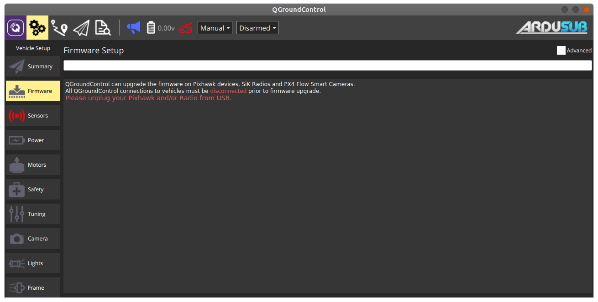
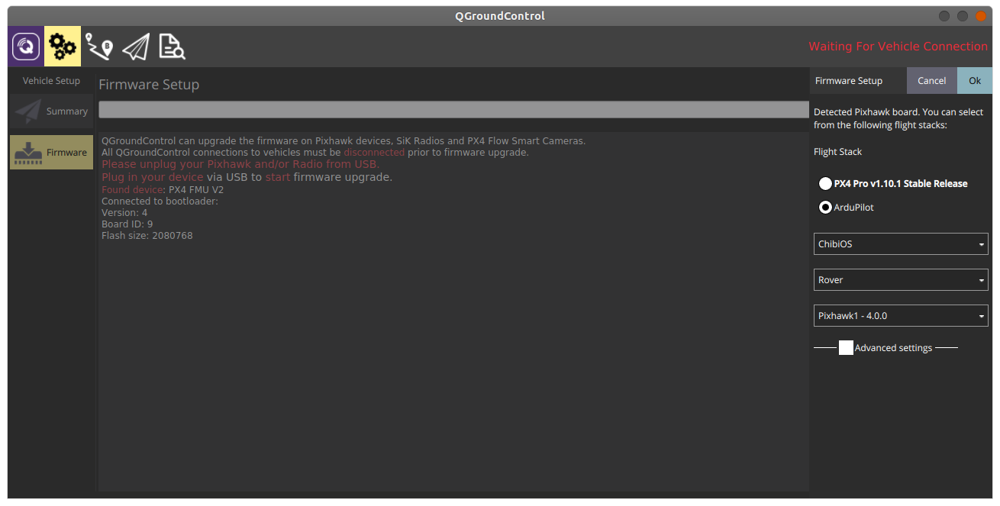

# Preparing your Jetson Nano image

When setting up the Jetson Nano, you will need a monitor, keyboard, mouse, and internet connection provided directly to the Nano. We recommend performing this setup before installing the Rambutan in your electronics box. This will give you room to plug in HDMI and USB cables for the setup process. If you don't have the ability to provide an ethernet connection to the internet (i.e. you only have WiFi), you will need a USB WiFi adapter. Some adapters do not work out of the box with the Nano as they lack compatible drivers. Be sure to check that the adapter you intend to use is supported before making any purchases.

## Creating an SD card with a working image

First, you will need to create a bootable SD card and set up your Jetson Nano, following the guide found here:
<https://developer.nvidia.com/embedded/learn/get-started-jetson-nano-devkit#intro>

As an additional resource, which includes some more detail, you can read:
<https://www.pyimagesearch.com/2020/03/25/how-to-configure-your-nvidia-jetson-nano-for-computer-vision-and-deep-learning/>

*NOTE:* At the time of writing this guide, the latest version available was 32.4.2, which includes Ubuntu 18.04 and CUDA 10.2.
The rest of this guide will assume the use of these versions.

## Software Setup

After finishing the hardware and SD image setup process, make sure you have an internet connection, power on the Nano and walk through the following commands in a terminal:

```bash
# First, update pre-installed software
sudo apt-get update
sudo apt-get upgrade

# Next we will install some basic tools and dependencies that we will need:
sudo apt-get update -y
    sudo apt-get install -y --no-install-recommends \
        apt-transport-https \
        apt-utils \
        build-essential \
        cmake \
        curl \
        git \
        gnupg2 \
        less \
        libv4l-dev \
        libxml2-dev \
        libxslt1-dev \
        lsb-release \
        nano \
        openssh-server \
        python3-pip \
        sudo \
        supervisor \
        udev \
        vim \
        wget

# Install ROS2 Eloquent:
# Note: We have to use Eloquent for now, because Foxy is only supported on Ubuntu 20.04, which isn't released for the Nano at the time of writing this guide.

# Set up apt sources list
curl -s https://raw.githubusercontent.com/ros/rosdistro/master/ros.asc | sudo apt-key add -
sudo sh -c 'echo "deb [arch=$(dpkg --print-architecture)] http://packages.ros.org/ros2/ubuntu $(lsb_release -cs) main" > /etc/apt/sources.list.d/ros2-latest.list'

# Install ROS2 Eloquent and some additional packages
sudo apt-get update -y
sudo apt-get install -y --no-install-recommends \
    ros-eloquent-ros-base \
    python3-argcomplete \
    python3-colcon-common-extensions \
    python3-rosdep \
    python3-vcstool \
    python3-wheel

# Install packages required to run mavproxy and status_light services
sudo -H pip3 install mavproxy Jetson.GPIO bluerobotics-ping

# Install Conan C++ package manager (used to build software)
pip3 install conan==1.26.1

# Add user and usr/local bin folders to PATH, so you can run conan
echo "PATH=\"\${PATH}:/home/${USER}/.local/bin:/usr/local/bin\"" >> ~/.bashrc
source ~/.bashrc


## ----------------------
# Set up various permissions and rules to make sure all files, cameras, and serial ports can be accessed

# Change permissions on /opt so you can write to it as a non-root user
sudo chown -R ${USER}:${USER} /opt

# First add your user to necessary groups
sudo usermod -a -G video ${USER}
sudo usermod -a -G tty ${USER}
sudo usermod -a -G dialout ${USER}

# Disable console on /dev/ttyTHS1 (pre-enabled on stock Nano images)
sudo systemctl stop nvgetty
sudo systemctl disable nvgetty

# Add udev rule to allow non-root access on /dev/ttyTHS* serial devices
sudo sh -c "echo 'KERNEL==\"ttyTHS*\", MODE=\"0666\"' > /etc/udev/rules.d/55-tegraserial.rules"

## -----------------------

# Download the ZED SDK that matches the Jetpack 4.4, CUDA 10.2 release on the Nano
curl -O https://stereolabs.sfo2.cdn.digitaloceanspaces.com/zedsdk/3.2/ZED_SDK_Tegra_JP44_v3.2.0.run

# Make the installer executable
chmod +x ZED_SDK_Tegra_JP44_v3.2.0.run

# Run and follow the instructions. Enter 'y' for all y/n prompts and leave values as their default
./ZED_SDK_Tegra_JP44_v3.2.0.run

# The output should look something like:

  # Verifying archive integrity...  100%   All good.
  # Uncompressing 'ZED camera SDK by Stereolabs'  100%  
  # Installing...
  # To continue you have to accept the EULA. Accept  [Y/n] ?y
  # Installing...
  # Installation path: /usr/local/zed
  # [sudo] password for youruser:
  # Checking CUDA version...
  # OK: Found CUDA 10.2
  # Do you want to install the static version of the ZED SDK [Y/n] ?y
  # Do you want to install the Object Detection module (recommended), cuDNN and TensorRT will be installed [Y/n] ?y
  # Install samples (recommended) [Y/n] ?y
  # Installation path: /usr/local/zed/samples/
  # Do you want to auto-install dependencies (recommended) ? following packet will be installed via the package manager : libjpeg-turbo8 libturbojpeg libusb-1.0 libopenblas-dev libv4l-0 curl unzip libpng-dev libglew-dev freeglut3-dev qt5-default libqt5opengl5 libqt5svg5 [Y/n] ?y
  # ...
  # Dependencies installation complete
  # ZED SDK installation complete !

# After successfully installing the ZED SDK, *WITH* the camera connected, run the following, which will open a GUI and also download the calibration file for your specific camera:
/usr/local/zed/tools/ZED_Explorer

# Now that everything has been installed, reboot so that certain modifications take effect
sudo reboot now
```

## Download and Build the OpenASV Software

Similar to the groundstation setup, we need to clone and build the software. *NOTE:* There are a few additional steps involved.

```bash
# Download the software to the /opt/openasv directory
git clone https://github.com/oceansystems/asv /opt/openasv

# Navigate to the software directory
cd /opt/openasv/vehicle

# Install systemd service files
sudo cp -a ./res/systemd/. /lib/systemd/system/

# Install conan configuration
mkdir -p ~/.conan/profiles
cp /opt/openasv/vehicle/res/conan/default ~/.conan/profiles/

# Build the conan dependencies
# NOTE: This will take some time on the first run
cd /opt/openasv/vehicle/conan-packages
./build.sh  

# Build the vehicle software
# NOTE: This will take some time on the first run
cd /opt/openasv/vehicle/src
./build.sh

# Once the software is successfully built, enable the installed systemd service files for the software
sudo systemctl enable asv_bridge
sudo systemctl enable mavproxy
sudo systemctl enable recorder
sudo systemctl enable status_light
```

## Running the vehicle software

The software is automatically started on boot up by Systemd. Below are some commands you can use to manually interact with systemd:

```bash
# Start a service:
sudo systemctl start asv_bridge

# Stop a service:
sudo systemctl stop asv_bridge

# Restart a service
sudo systemctl restart asv_bridge

# Disable a service so it doesn't start at startup automatically:
sudo systemctl disable asv_bridge
```

Viewing real-time console logs of the applications can be done with journalctl:

```bash
# To view an entire log:
journalctl -u asv_bridge

# To trail a log in real-time
journalctl -u asv_bridge -f
```

## Setting up a USB flash drive for data storage

We will want to make sure that when using a USB flash drive, the drive is always automatically mounted at boot and mounts to a consistent filesystem location, so our software can locate it.

First, format a flash drive using your preferred method. We recommend using the FAT32 format and the following instructions will assume a drive formatted to FAT32.

Once you have a USB drive formatted to FAT32, plug it into a free USB port on the Nano. Next, follow these steps:

```bash
# With your USB drive plugged in, run:
sudo blkid

# Look for your flash drive in the output of the previous command. \
# As an example, for a flash drive with a label name of "CYBIE", this is returned:
# /dev/sda1: LABEL="CYBIE" UUID="B668-998A" TYPE="vfat" PARTUUID="e1ee37e1-01"

# Create a variable with the UUID information for your device. As an example:
export USB_UUID="B668-998A"

# Copy the UUID value and add it to your /etc/fstab file in the following manner:
sudo sh -c "UUID=${USB_UUID} /media/${USER}/usb vfat rw,nofail,umask=022,uid=1000,gid=1000 0 0"

# Create the directory and change its permissions
sudo mkdir -p /media/${USER}/usb
sudo chown ${USER}:${USER} /media/${USER}/usb

# Reboot to get the above changes to take effect and then verify that the device is successfully mounted by writing a file to it and checking it on another device
sudo reboot now
```

## Configuring the data recording location for the ASV software

In general, you will want to configure your software to write data to a USB3 flash drive, such that you don't accidentally fill up the Nano's main filesystem. This will also allow you to easily offload the recordings, which can quickly grow to several gigabytes in size.

To configure the storage location, modify the `/opt/openasv/vehicle/src/recorder/config/recorder.yaml` file, which has contents that default to:

```yaml
recorder:
  ros__parameters:
    minimum_sample_period_msecs: 2000
    storage_path: "/tmp"
```

If you configured your USB drive to mount to /media/${USER}/usb, set the storage_path variable to match that (replacing ${USER} with your actual username).

If you like, you can also modify the minimum period that `recorder` records samples at. By default, `recorder` will record samples no faster than once every 2000ms (recording is triggered on the earliest GPS update that happens after this period). By increasing the minimum period, you can control how quickly your storage disk space fills up, depending on your application and setup's needs.

## Configuring the Pixhawk

### First Time Firmware Flash

Depending on where you purchased the Pixhawk from, it is most likely the case that your Pixhawk does not have the correct firmware version flashed on it straight out of the box. The firmware can only be reflashed when connected directly to a PC over USB, so this process will first require us to temporarily disconnect the Pixhawk from the Jetson Nano. Once that is done, the following steps and photos describe how to flash the correct firmware to the Pixhawk.

1. First connect the groundstation PC directly to the Pixhawk via USB micro port
2. Open QGroundControl and wait for it to detect the Pixhawk
3. Click on the `Firmware` tab on the left

  

4. Follow the instructions for flashing new firmware and unplug the Pixhawk, then plug it back in
5. Select the following settings in the box on the right:
   - Ardupilot
   - ChibiOS
   - Rover
   - Pixhawk1 - 4.0.0

  

6. Click Ok to begin the firmware flash process
7. Once the flashing process is complete, the Pixhawk will reboot and QGroundControl will detect it again once it completes the reboot process

  

8. Now that the firmware has been upgraded, you can disconnect the Pixhawk from your groundstation PC and reconnect the Pixhawk to the Jetson Nano.

### System Bring-up

Now that the Pixhawk has the correct firmware and is reconnected to the Jetson Nano, you will need to close the electrical box back up and finish any hardware configurations for your vehicle such that it is ready for flight.

Once all hardware preparations are complete, we are ready to power on the vehicle and make some final software configurations in QGroundControl.

Turn your entire system on, open QGroundControl and make sure you have a connection for the following steps.

```
NOTE: Many of the steps to follow involve rebooting the Pixhawk after making changes. The simplest way to do this with the vehicle fully assembled is to disconnect and reconnect the battery. Please pay attention to all prompts within QGroundControl to reboot after performing certain configurations/calibrations.
```

### Initial Parameter Flash

We will start by uploading a pre-configured baseline parameter file that will get most things working out of the box, provided the motor and pixhawk configuration matches the hardware reference provided in this project. To upload this file:

1. In QGroundControl on the left menu, click the `Parameters` tab
2. In the top right, click the `Tools` button
3. Select `Load from file`
4. Within this git repo, navigate to and select the file: `groundstation/config/asv_initial_params.params`
5. After the file has been successfully uploaded, power cycle the vehicle.

```
NOTE: The safety configurations in this included param file are fairly lax, in terms of aspects like how good of a GPS fix the vehicle needs before allowing a mission to begin and some pre-flight checks that restrict when the vehicle can arm or disarm. If you would like to be more cautious, it is worth reading the Ardurover and QGroundControl docs and reviewing any parameters relating to arming and safety before operating the vehicle in the field.
```

### Frame Configuration

The vehicle frame is selected in the `Frame` tab of the `Vehicle Setup` page. Choose the `Boat` frame.

  

### Sensor Calibration

First, depending on how you physically orient the pixhawk, you will need to adjust the autopilot orientation.

1. Go to `Settings`in QGC and select the `Sensors` tab on the left.
2. Choose the appropriate autopilot orientation in the dropdown box:
   - *None* if the Pixhawk's arrow is pointing in the forward direction of travel of your vehicle
   - *YawX* if it is rotated about the Z-axis. You will need to determine the amount (X).

Next, you will need to walk through the calibration process for your sensors:

1. Click on `Accelerometers` and follow the instructions
2. Click on `Compass` and follow the instructions

Finally, you will need to configure the Power parameters, by clicking on the `Power` tab.

1. In the `Battery monitor` field, select `Analog Voltage and Current`
2. The `Battery capacity` field will depend on your battery. If using the BlueRobotics 18Ah battery, set this to 18000 mAh
3. Leave `Minimum arming voltage` set to 0.0
4. In the `Power sensor` field, select `Blue Robotics Power Sense Module R2`

## Further reading

The scope of this project does not currently cover all of the various topics relating to QGroundControl or the Pixhawk/Ardurover configuration, nor does it provide any detailed instruction on how to use these pieces of software. In particular, if you have deviated from the hardware configuration or vehicle topology specified within this tutorial's docs, you may need to further customize the Pixhawk parameters. For further information or more detailed information and instructions for each project, please see the following links:

### ArduRover Docs

<https://ardupilot.org/rover/index.html>

### QGroundControl & Mavlink Docs

<https://www.dronecode.org/documentation/>
