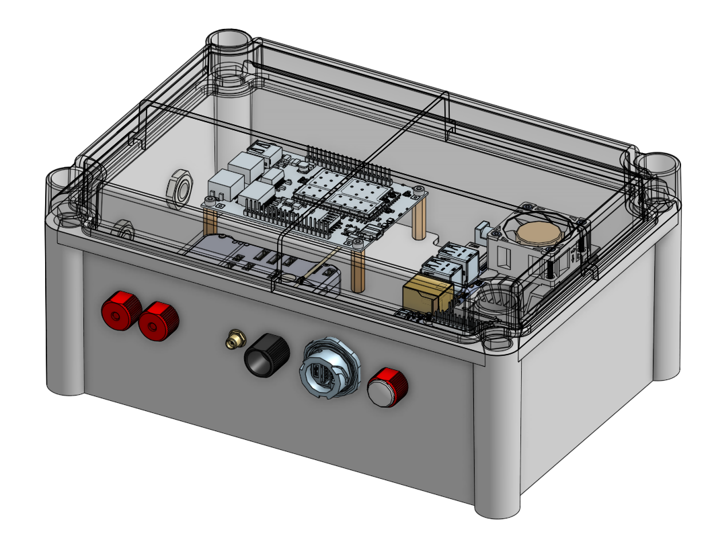
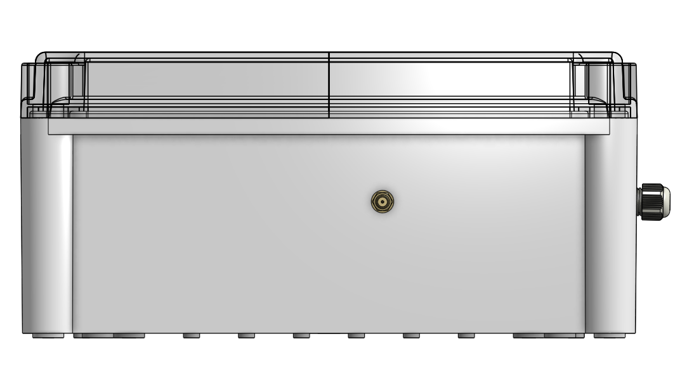
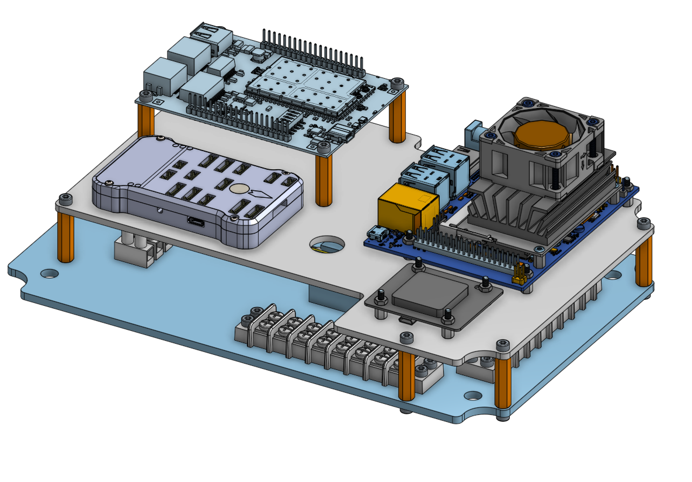
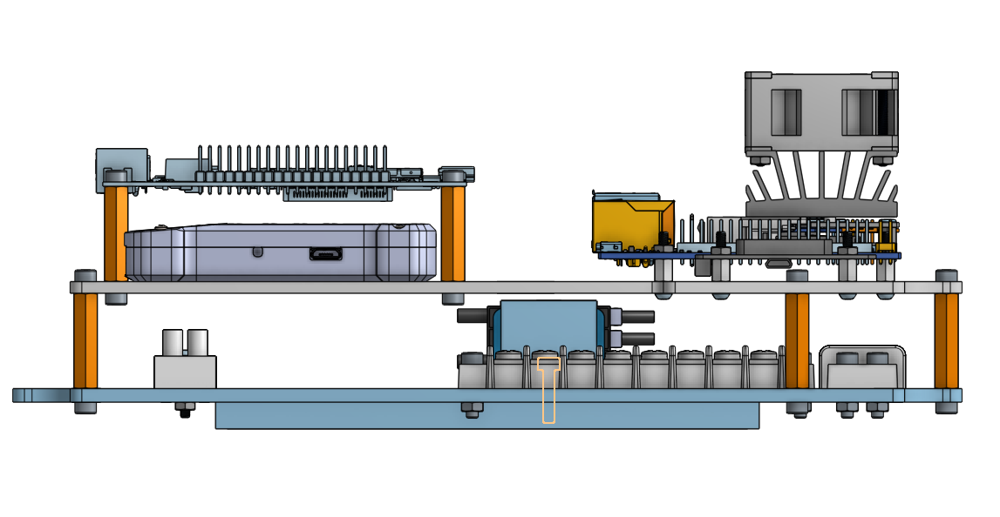
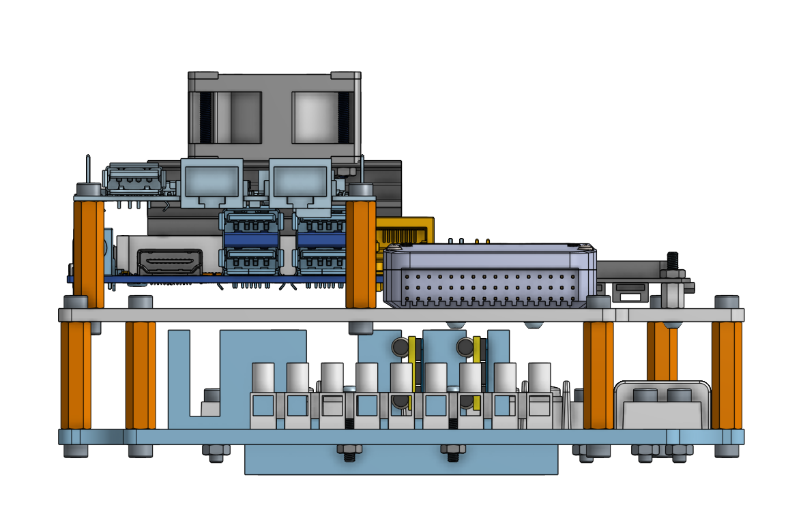
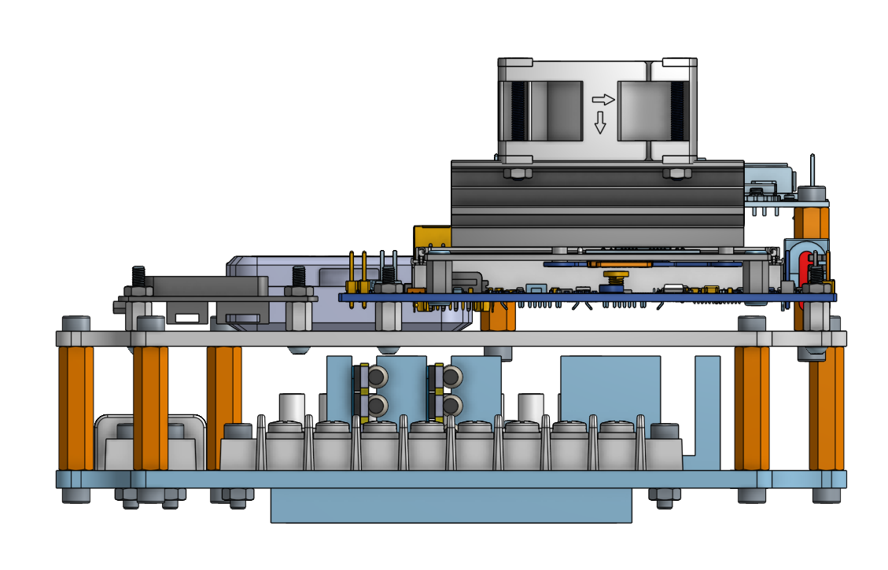
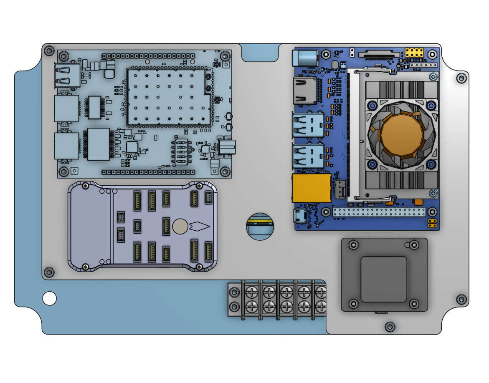
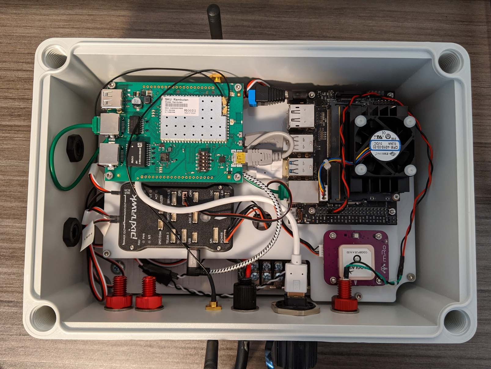

# Hardware Setup

## Pre-reqs
### Tools
- Drill + various drill bits (see drawings)
- Deburring tool (to clean up drill holes)
- Screwdriver set (phillips, slotted, hex)
- Crescent wrench (expands to at least 32mm)
- Needle nose pliers
- Scissors or flush cutters

### Parts
Refer to the [Bill of Materials (BOM)](bill_of_materials.pdf) for the list of parts

#### Not on Bill of Materials
- [Upper Plate](drawings_and_cad/upper_plate/) - This part can be laser cut out of 3mm thick material.
- [Power Mounting Block](drawings_and_cad/power_mounting_block/) - This part can be 3D printed
- Double sided tape (to secure Pixhawk)
- Grease (for o-rings)
- USB 3.0 SSD (for storing data)

## Assembly

### General Assembly Notes
- Make sure to lubricate all o-rings before installation
- M2.5x22mm screws (x4) are only used to attach the fan to the Jetson Nano

### Drill Enclosure
Refer to the [enclosure drawing](drawings_and_cad/enclosure/DRW-0023-01_PTS-25340-C_with_holes.pdf) for the location the holes should be drilled, as well as the hole diameter. The hole callouts are for clearance holes for parts to fit through. This means the sizes are less common. You can use a drill that is +/- 0.2mm without issue. Also, while all dimensions are metric, sometimes a standard drill bit will be a close match.

### Drill Bottom Plate
Refer to the [bottom plate drawing](drawings_and_cad/lower_plate/DRW-0019-01_PTV-25340_with_holes.pdf) for the location the holes should be drilled, as well as the hole diameter. The hole callouts are for clearance holes for parts to fit through. This means the sizes are less common. You can use a drill that is +/- 0.2mm without issue. Also, while all dimensions are metric, sometimes a standard drill bit will be a close match.

There are 3 sets of holes for the Eurostyle Terminal Block. This is to allow for some adjustment depending on wire length.

### Battery Tube Assembly
[Follow the Blue Robotics Guide](https://bluerobotics.com/learn/watertight-enclosure-assembly-guide/)

### Electrical Wiring
Follow the [System Diagram](system_diagram.pdf) and [Electrical Connections](electrical_connections.pdf) diagrams.

### Final Assembly
#### Enclosure Assembly

#### Plates Assembly

#### Final Assembly Pictures

### Other Notes
- The two blank penetrators are there for accessories that can be connected to the system.
- The antenna (RP-SMA) connectors on the side of the box can be replaced with cables and different antennas, depending on your use case.
- GPS should have clear view of the sky.
- Keep out of direct sunlight when powered on.