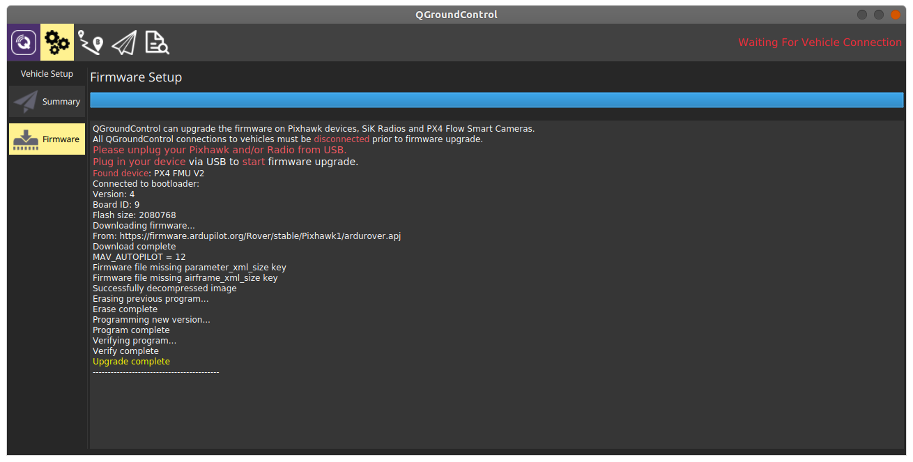
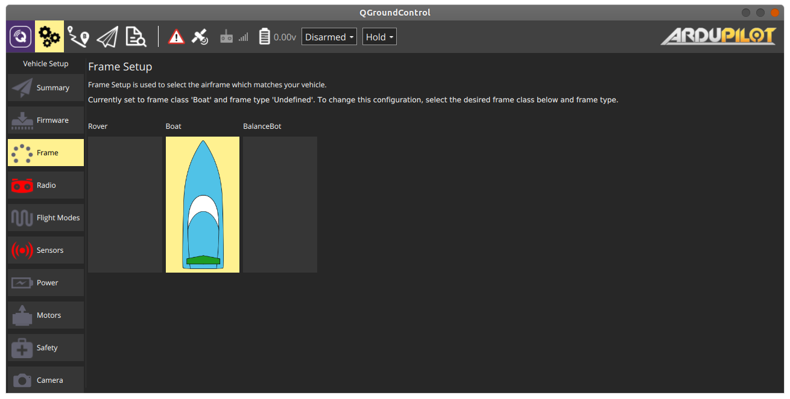

# Configuring the Pixhawk

## First Time Firmware Flash

Depending on where you purchased the Pixhawk from, it is most likely the case that your Pixhawk does not have the correct firmware version flashed on it straight out of the box. The firmware can only be reflashed when connected directly to a PC over USB, so this process will first require us to temporarily disconnect the Pixhawk from the Jetson Nano. Once that is done, the following steps and photos describe how to flash the correct firmware to the Pixhawk.

1. First connect the groundstation PC directly to the Pixhawk via USB micro port
2. Open QGroundControl and wait for it to detect the Pixhawk
3. Click on the `Firmware` tab on the left

  

4. Follow the instructions for flashing new firmware and unplug the Pixhawk, then plug it back in
5. Select the following settings in the box on the right:
   - Ardupilot
   - ChibiOS
   - Rover
   - Pixhawk1 - 4.0.0

  

6. Click Ok to begin the firmware flash process
7. Once the flashing process is complete, the Pixhawk will reboot and QGroundControl will detect it again once it completes the reboot process

  

8. Now that the firmware has been upgraded, you can disconnect the Pixhawk from your groundstation PC and reconnect the Pixhawk to the Jetson Nano.

### System Bring-up

Now that the Pixhawk has the correct firmware and is reconnected to the Jetson Nano, you will need to close the electrical box back up and finish any hardware configurations for your vehicle such that it is ready for flight.

Once all hardware preparations are complete, we are ready to power on the vehicle and make some final software configurations in QGroundControl.

Turn your entire system on, open QGroundControl and make sure you have a connection for the following steps.

```
NOTE: Many of the steps to follow involve rebooting the Pixhawk after making changes. The simplest way to do this with the vehicle fully assembled is to disconnect and reconnect the battery. Please pay attention to all prompts within QGroundControl to reboot after performing certain configurations/calibrations.
```

## Initial Parameter Flash

We will start by uploading a pre-configured baseline parameter file that will get most things working out of the box, provided the motor and pixhawk configuration matches the hardware reference provided in this project. To upload this file:

1. In QGroundControl on the left menu, click the `Parameters` tab
2. In the top right, click the `Tools` button
3. Select `Load from file`
4. Within this git repo, navigate to and select the file: `groundstation/config/asv_initial_params.params`
5. After the file has been successfully uploaded, power cycle the vehicle.

```
NOTE: The safety configurations in this included param file are fairly lax, in terms of aspects like how good of a GPS fix the vehicle needs before allowing a mission to begin and some pre-flight checks that restrict when the vehicle can arm or disarm. If you would like to be more cautious, it is worth reading the Ardurover and QGroundControl docs and reviewing any parameters relating to arming and safety before operating the vehicle in the field.
```

## Frame Configuration

The vehicle frame is selected in the `Frame` tab of the `Vehicle Setup` page. Choose the `Boat` frame.

  

## Sensor Calibration

First, depending on how you physically orient the pixhawk, you will need to adjust the autopilot orientation.

1. Go to `Settings`in QGC and select the `Sensors` tab on the left.
2. Choose the appropriate autopilot orientation in the dropdown box:
   - *None* if the Pixhawk's arrow is pointing in the forward direction of travel of your vehicle
   - *YawX* if it is rotated about the Z-axis. You will need to determine the amount (X).

Next, you will need to walk through the calibration process for your sensors:

1. Click on `Accelerometers` and follow the instructions
2. Click on `Compass` and follow the instructions

Finally, you will need to configure the Power parameters, by clicking on the `Power` tab.

1. In the `Battery monitor` field, select `Analog Voltage and Current`
2. The `Battery capacity` field will depend on your battery. If using the BlueRobotics 18Ah battery, set this to 18000 mAh
3. Leave `Minimum arming voltage` set to 0.0
4. In the `Power sensor` field, select `Blue Robotics Power Sense Module R2`

## Further reading

The scope of this project does not currently cover all of the various topics relating to QGroundControl or the Pixhawk/Ardurover configuration, nor does it provide any detailed instruction on how to use these pieces of software. In particular, if you have deviated from the hardware configuration or vehicle topology specified within this tutorial's docs, you may need to further customize the Pixhawk parameters. For further information or more detailed information and instructions for each project, please see the following links:

### ArduRover Docs

<https://ardupilot.org/rover/index.html>

### QGroundControl & Mavlink Docs

<https://www.dronecode.org/documentation/>